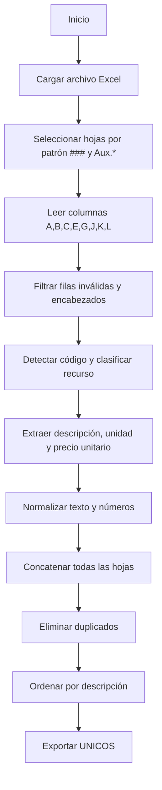

## 📘 Documento de Reglas y Contrato del ETL UNICOS

### 🎯 Objetivo
Unificar recursos desde un Excel multi-hoja en un único dataset **UNICOS**, extrayendo **Equipos**, **Mano de Obra**, **Materiales** y **Transporte** con sus **unidades**, **precio unitario (tarifa)**, **CPC Elemento**, **NP/ND/EP** y **VAE (%)**.

### ✅ Contrato de Entrada (Excel)
**Formato esperado**:
- Archivo `.xlsx` con múltiples hojas.
- Hojas numéricas con formato `###` (por defecto `001`, `002`, etc.).
- Opcional: hojas auxiliares `Aux.*`.

**Columnas requeridas (por letra)**:
- **A → Column1**: Código o identificador (se usa para clasificar recurso).
- **B → Column2**: Código alterno (si existe).
- **C → Column3**: Descripción.
- **E → Column5**: Tarifa (Equipos/Mano de Obra) o Unidad (Materiales/Transporte).
- **G → Column7**: Precio unitario (Materiales/Transporte).
- **J → Column10**: CPC Elemento.
- **K → Column11**: NP/ND/EP.
- **L → Column12**: VAE (%).

**Filas inválidas**:
- Vacías en descripción (Column3).
- Encabezados de sección (EQUIPOS, MANO DE OBRA, MATERIALES, TRANSPORTE).

### ⚙️ Configuración
- `sheet_pattern`: regex para hojas numéricas. Default `^\d{3}$`.
- `max_sheet`: máximo de hojas a procesar (0 = todas).
- `include_aux`: incluir hojas `Aux.*`.
- `include_otro`: incluir recursos sin clasificación (OTRO).
- `CODE_PATTERN`: regex para extraer código si viene embebido en texto.

### 🧠 Reglas de Clasificación (RECURSO)
Se clasifica por la **primera letra** del código detectado:
- `M` → EQUIPO
- `N` → MANO DE OBRA
- `O` → MATERIAL
- `P` → TRANSPORTE
- Otro → OTRO

### 🔎 Reglas de Extracción
- **DESCRIPCION**: Column3 (limpia).
- **PRECIO UNITARIO**:
  - Equipos y Mano de Obra → Column5 (tarifa/costo hora)
  - Materiales y Transporte → Column7 (precio unitario)
- **UNIDAD**:
  - Equipos y Mano de Obra → vacío
  - Materiales y Transporte → Column5
- **CPC ELEMENTO**: Column10
- **NP/ND/EP**: Column11
- **VAE (%)**: Column12 (se mantiene como porcentaje numérico, ej. 40.0)

> Equipos y Mano de Obra tienen además **Rendimiento (h/U)** en el Excel,
> pero **no se exporta** en la salida final a menos que se solicite.

### 🔧 Normalización
- **Números**: acepta formatos `1,234.56`, `1.234,56`, `10%`.
- **Texto**: se limpia con `strip()`.

### 🧩 Agrupación y Unificación (UNICOS)
- Se concatenan todas las hojas válidas.
- Se eliminan duplicados según columnas finales.
- Orden final por **DESCRIPCION**.

### 📤 Salida Final (UNICOS)
**Columnas esperadas** (sin código ni hoja):
- `DESCRIPCION`
- `UNIDAD` (si aplica)
- `PRECIO UNITARIO`
- `CPC ELEMENTO`
- `NP/ND/EP`
- `VAE (%)`
- `RECURSO`

---

### 🗺️ Diagrama del Flujo ETL (Mermaid)

